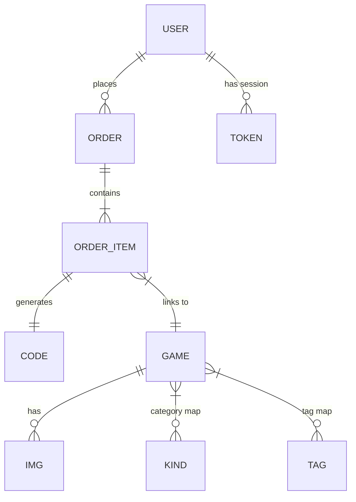
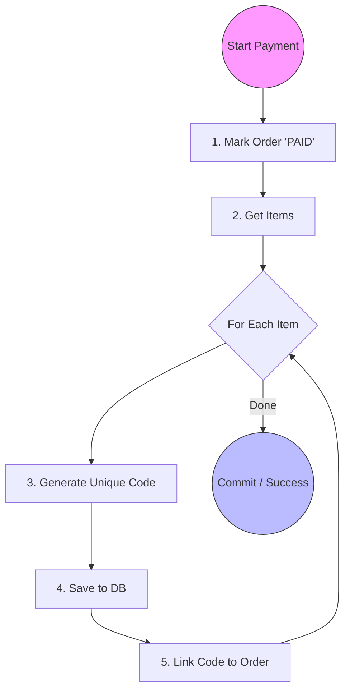

# 🎮 High-Performance GameStore Backend

-blue)

## 📖 Overview

This project is a production-grade backend system for trading digital game assets. Unlike simple CRUD apps, this system solves real-world engineering challenges: **preventing financial data errors**, **optimizing database structure**, and **handling high concurrency**.

Key features include secure Salted MD5 authentication, atomic payment processing, and intelligent caching strategies.

---

## 🏗️ Database Architecture (3NF)

We designed the database using **Third Normal Form (3NF)** to ensure data is clean, organized, and redundant-free.

### 1. Key Entities
* **User & Security:** Tracks user status (`stat`) and manages secure sessions via `token` tables (linking User ID to IP/Device).
* **Game Assets:** Games are categorized efficiently using mapping tables (`kindmapper`, `tagmapper`), allowing for complex filtering without data duplication.
* **Smart Orders:**
    * `Order`: The main transaction record.
    * `OrderItem`: Locks in the price and game ID at the exact time of purchase.
    * `Code`: The unique digital product key, generated *only* after a successful payment.

### 2. Schema Diagram (ERD)
The diagram below shows how a User flows to a purchased Code through Orders.

### ⚡ Engineering Highlights
* **Normalization:** We use intermediate tables for Many-to-Many relationships (e.g., Games ↔ Tags) to keep the schema flexible.
* **Indexing:** High-frequency lookups (like username login) are boosted using optimized **B+ Tree indexes**.

---

## 🔐 Transaction & Payment Logic

Handling money requires precision. We strictly enforce **ACID properties** to ensure no data is ever lost or corrupted.

### The "All-or-Nothing" Payment Flow
We use `Spring @Transactional` to wrap the entire payment logic. This guarantees that **Status Updates**, **Code Generation**, and **Data Linking** happen together. If one step fails, everything rolls back.

### Why this is reliable:
* **Unique Codes:** Every asset gets a globally unique UUID.
* **Auto-Rollback:** If a network error occurs at Step 4, the Order Status automatically reverts to 'UNPAID'. No "paid but received nothing" scenarios.

---

## 🛡️ Performance & Self-Maintenance

To keep the system fast and healthy, we implemented automated governance and caching.

### 1. Automated Cleanup (Cron Jobs)
The system automatically cleans itself to prevent "data bloat":
* **Zombie Orders:** A scheduler (`autoCancelOrder`) runs every minute to cancel orders unpaid for **>15 minutes**, releasing inventory.
* **Spam Accounts:** The `delNotValidateUser` task deletes unverified accounts created over **1 hour ago**.

### 2. Redis Caching Strategy
* **Hot Data:** Frequently accessed public data (like "Daily Deals") is cached in Redis. We set a **TTL (Time-To-Live)** so it expires exactly at midnight.
* **Fast Login:** The `AuthInterceptor` checks Redis first for user sessions, significantly reducing load on the main MySQL database.

### 3. Async Concurrency
* **Thread Pool:** Slow tasks (like sending emails) are offloaded to a `ThreadPoolExecutor`. This prevents the main thread from blocking during high traffic spikes.

---

## 📂 Project Structure

* `/sql`: Database schema setup, constraints, and data dictionary.
* `/src`: Java source code (Controllers, Services, MyBatis Mappers).
